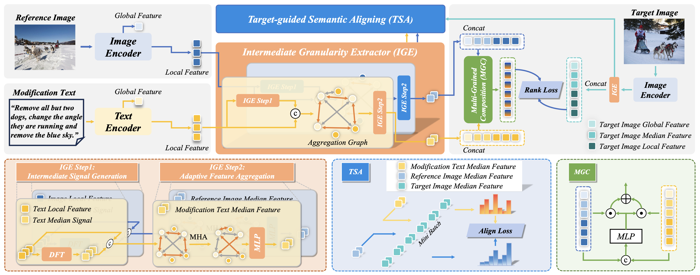
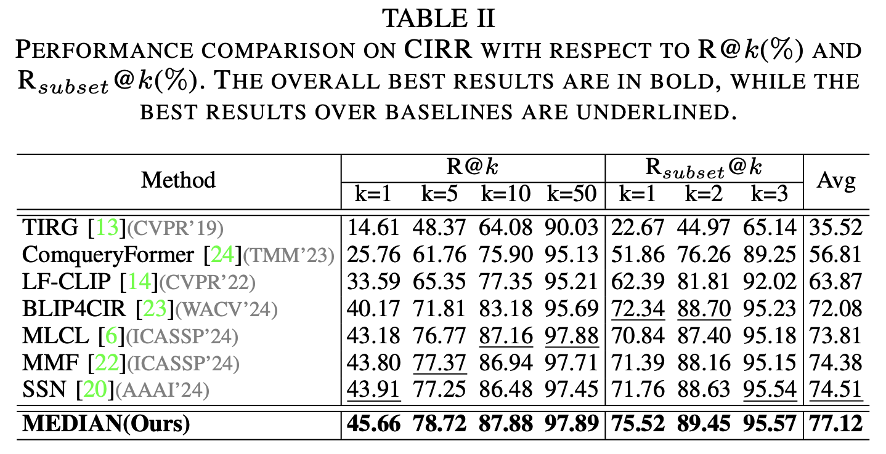
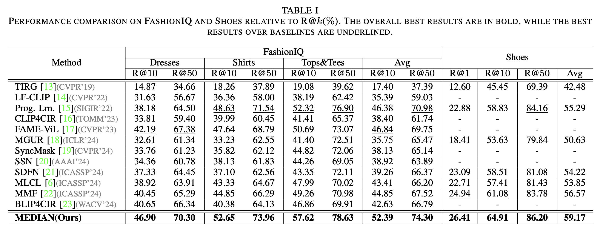

<a id="top"></a>
<div align="center">
  <!-- TODO_LOGO_PATH: Replace with actual logo asset path, e.g. ./assets/logo/median-logo.png -->
  

  <h1>MEDIAN: Adaptive Intermediate-grained Aggregation Network for Composed Image Retrieval</h1>

  <div class="is-size-5 publication-authors">
    <span class="author-block" style="font-weight: 1000;">
      <a href="https://windlikeo.github.io/HQL.github.io/" target="_blank" class="author-link">Qinlei Huang<sup>1</sup></a>,
    </span>
    <span class="author-block" style="font-weight: 1000;">
      <a href="https://zivchen-ty.github.io" target="_blank" class="author-link">Zhiwei Chen<sup>1</sup></a>,
    </span>
    <span class="author-block" style="font-weight: 1000;">
      <a href="https://lee-zixu.github.io" target="_blank" class="author-link">Zixu Li<sup>1</sup></a>,
    </span>
    <span class="author-block" style="font-weight: 1000;">
      <span>Chunxiao Wang<sup>2</sup></span>,
    </span>
    <span class="author-block" style="font-weight: 1000;">
      <a href="https://xuemengsong.github.io" target="_blank" class="author-link">Xuemeng Song<sup>3</sup></a>,
    </span>
    </br>
    <span class="author-block" style="font-weight: 1000;">
      <a href="https://faculty.sdu.edu.cn/huyupeng1/zh_CN/index.htm" target="_blank" class="author-link">Yupeng Hu<sup>1&#9993</sup></a>,
    </span>
    <span class="author-block" style="font-weight: 1000;">
      <a href="https://liqiangnie.github.io/index.html" target="_blank" class="author-link">Liqiang Nie<sup>4</sup></a>,
    </span>
  </div>

  <div class="is-size-5 publication-authors">
    <span class="author-block">
      <sup>1</sup>School of Software, Shandong University,<br>
      <sup>2</sup>Key Laboratory of Computing Power Network and Information Security, Ministry of Education, Qilu University of Technology (Shandong Academy of Sciences)<br>
      <sup>3</sup>School of Computer Science and Technology, Shandong University,<br>
      <sup>4</sup>School of Computer Science and Technology, Harbin Institute of Technology (Shenzhen)
    </span>
    <br />
    <sup>&#9993&#160;</sup>Corresponding author&#160;&#160;</span>
  </div>

  <p>
    <a href="https://ieeexplore.ieee.org/document/10890642"></a>
    <a href="https://windlikeo.github.io/MEDIAN.github.io/"></a>
    <a href="https://windlikeo.github.io/HQL.github.io/"></a>
    <a href="https://pytorch.org/get-started/locally/"></a>
    
    <a href="TODO_REPOSITORY_URL"></a>
  </p>

  <p>
    <b>Official Repository:</b> This is an open-source implementation of the paper "MEDIAN: Adaptive Intermediate-grained Aggregation Network for Composed Image Retrieval".
  </p>
</div>

## 📌 Introduction

**MEDIAN** (Adaptive Intermediate-grained Aggregation Network for Composed Image Retrieval) is the project documented in this repository. By adaptively aggregating intermediate-grained features and utilizing target-guided semantic alignment, MEDIAN effectively establishes cross-modal correspondences between reference images and modification texts. This approach achieves precise "local-intermediate-global" feature composition, addressing the limitations of existing methods that solely focus on local and global granularity, thereby significantly enhancing retrieval performance.

[⬆ Back to top](#top)

## 📢 News

* **[2025-03]** 🔥 The paper *"MEDIAN: Adaptive Intermediate-grained Aggregation Network for Composed Image Retrieval"* has been accepted by ICASSP 2025!
* **[2024-09]** 🚀 Release all codes of MEDIAN!

[⬆ Back to top](#top)

## 🏗️ Architecture

<p align="center">
  <!-- TODO_ARCHITECTURE_FIGURE_PATH: Replace with actual architecture figure path, e.g. assets/median.png -->
  
  <figcaption><strong>Figure 1.</strong> The overall framework of MEDIAN. <em>(Update with actual architecture figure)</em></figcaption>
</p>

[⬆ Back to top](#top)

## 🏃‍♂️ Experiment Results

> 💡 <span style="color:#2980b9;">**Note:**</span> <br>
> 🎯 We evaluate MEDIAN extensively on three standard CIR datasets. Please refer to our main paper for detailed comparative analyses and ablation studies.

### CIR Task Performance

#### CIRR:
<p align="center">
   <br>
<caption><strong>Table 1.</strong> Performance comparison on the CIRR test set in terms of R@K (%) and Rsub@K (%).</caption>
</p>


#### FashionIQ & Shoes:
<p align="center">
   <br>
<caption><strong>Table 2.</strong> Performance comparison on FashionIQ and Shoes validation sets in terms of R@K (%).</caption>
</p>

[⬆ Back to top](#top)

---

## Table of Contents

- [Introduction](#-introduction)
- [News](#-news)
- [Architecture](#-architecture)
- [Experiment Results](#-experiment-results)
- [Install](#-install)
- [Data Preparation](#-data-preparation)
- [Quick Start](#-quick-start)
- [Acknowledgement](#-acknowledgement)
- [Related Projects](#-related-projects)
- [Citation](#-citation)
- [Support & Contributing](#-support--contributing)
- [License](#-license)

---

## 📦 Install

**1. Clone the repository**

```bash
git clone [https://github.com/WindLikeo/MEDIAN](https://github.com/WindLikeo/MEDIAN)
cd MEDIAN
```

**2. Setup Python Environment**
The code is evaluated with Python 3.8.10 and PyTorch 2.0.0 on an NVIDIA Tesla T4 16G platform. We recommend using Anaconda to create an isolated virtual environment:

```bash
conda create -n pair python=3.8.10
conda activate pair

# Install PyTorch
pip install torch==2.0.0 torchvision torchaudio --index-url [https://download.pytorch.org/whl/cu118](https://download.pytorch.org/whl/cu118)

# Install core dependencies (add other requirements as needed)
pip install -r requirements.txt
```

[⬆ Back to top](#top)

---

## 📂 Data Preparation

We evaluated our framework on three standard datasets: CIRR, FashionIQ, and Shoes. Please download the datasets first.

<details>
<summary><b>Click to expand: CIRR Dataset Directory Structure</b></summary>

After downloading the dataset, ensure that the folder structure matches the following:
```
├── CIRR
│   ├── train
|   |   ├── [0 | 1 | 2 | ...]
|   |   |   ├── [train-10108-0-img0.png | train-10108-0-img1.png | ...]
│   ├── dev
|   |   ├── [dev-0-0-img0.png | dev-0-0-img1.png | ...]
│   ├── test1
|   |   ├── [test1-0-0-img0.png | test1-0-0-img1.png | ...]
│   ├── cirr
|   |   ├── captions
|   |   |   ├── cap.rc2.[train | val | test1].json
|   |   ├── image_splits
|   |   |   ├── split.rc2.[train | val | test1].json
```
</details>

<details>
<summary><b>Click to expand: FashionIQ Dataset Directory Structure</b></summary>

After downloading the dataset, ensure that the folder structure matches the following:
```
├── FashionIQ
│   ├── captions
|   |   ├── cap.dress.[train | val | test].json
|   |   ├── cap.toptee.[train | val | test].json
|   |   ├── cap.shirt.[train | val | test].json
│   ├── image_splits
|   |   ├── split.dress.[train | val | test].json
|   |   ├── split.toptee.[train | val | test].json
|   |   ├── split.shirt.[train | val | test].json
│   ├── dress
|   |   ├── [B000ALGQSY.jpg | B000AY2892.jpg | B000AYI3L4.jpg |...]
│   ├── shirt
|   |   ├── [B00006M009.jpg | B00006M00B.jpg | B00006M6IH.jpg | ...]
│   ├── toptee
|   |   ├── [B0000DZQD6.jpg | B000A33FTU.jpg | B000AS2OVA.jpg | ...]
```

</details>

<details>
<summary><b>Click to expand: Shoes Dataset Directory Structure</b></summary>

After downloading the dataset, ensure that the folder structure matches the following:
```
├── Shoes
│   ├── captions_shoes.json
│   ├── eval_im_names.txt
│   ├── relative_captions_shoes.json
│   ├── train_im_names.txt
│   ├── [womens_athletic_shoes | womens_boots | ...]
|   |   ├── [0 | 1]
|   |   ├── [img_womens_athletic_shoes_375.jpg | descr_womens_athletic_shoes_734.txt | ...]
```

</details>

[⬆ Back to top](#top)

---

## 🚀 Quick Start

**1. Training**

The original project notes document the following training command and dataset path arguments:

```bash
python3 train.py \
  --model_dir ./checkpoints/MEDIAN \
  --dataset {cirr,fashioniq,shoes} \
  --cirr_path "" \
  --fashioniq_path "" \
  --shoes_path ""
```

**Arguments:**

| Argument | Description |
| --- | --- |
| `--dataset <str>` | Dataset to use, options: `['cirr', 'fashioniq', 'shoes']` |
| `--cirr_path <str>` | Path to the CIRR dataset root folder |
| `--fashioniq_path <str>` | Path to the FashionIQ dataset root folder |
| `--shoes_path <str>` | Path to the Shoes dataset root folder |
| `--model_dir <str>` | Path to save checkpoints and logs |

**2. Testing**

The original project notes document the following CIRR test submission command:

```bash
python src/cirr_test_submission.py model_path
```

Where:

```text
model_path <str> : Path to a MEDIAN checkpoint trained on CIRR, e.g. "checkpoints/MEDIAN_CIRR.pt"
```

(Where checkpoints/MEDIAN_CIRR.pt is the path to your trained PAIR checkpoint).

[⬆ Back to top](#top)

---

## 🤝 Acknowledgement

This codebase is heavily inspired by and built upon [CLIP4Cir](https://github.com/ABaldrati/CLIP4Cir). We express our sincere gratitude to these open-source contributions!

[⬆ Back to top](#top)

---

## 🔗 Related Projects

Ecosystem & Other Works from our Team

<table style="width:100%; border:none; text-align:center; background-color:transparent;">
  <tr style="border:none;">
    <td style="width:30%; border:none; vertical-align:top; padding-top:30px;">
      <br>
      <b>ConeSep (CVPR'26)</b><br>
      <span style="font-size: 0.9em;">
        <a href="https://lee-zixu.github.io/ConeSep.github.io/" target="_blank">Web</a> | 
        <a href="https://github.com/lee-zixu/ConeSep" target="_blank">Code</a> | 
        <!-- <a href="https://ojs.aaai.org/index.php/AAAI/article/view/37608" target="_blank">Paper</a> -->
      </span>
    </td>
     <td style="width:30%; border:none; vertical-align:top; padding-top:30px;">
      <br>
      <b>Air-Know (CVPR'26)</b><br>
      <span style="font-size: 0.9em;">
        <a href="https://zhihfu.github.io/Air-Know.github.io/" target="_blank">Web</a> | 
        <a href="https://github.com/zhihfu/Air-Know" target="_blank">Code</a> | 
        <!-- <a href="https://ojs.aaai.org/index.php/AAAI/article/view/37608" target="_blank">Paper</a> -->
      </span>
    </td>
    <td style="width:30%; border:none; vertical-align:top; padding-top:30px;">
      <br>
      <b>HABIT (AAAI'26)</b><br>
      <span style="font-size: 0.9em;">
        <a href="https://lee-zixu.github.io/HABIT.github.io/" target="_blank">Web</a> | 
        <a href="https://github.com/Lee-zixu/HABIT" target="_blank">Code</a> | 
        <a href="https://ojs.aaai.org/index.php/AAAI/article/view/37608" target="_blank">Paper</a>
      </span>
    </td>
  </tr>    
  <tr style="border:none;">
    <td style="width:30%; border:none; vertical-align:top; padding-top:30px;">
      <br>
      <b>ReTrack (AAAI'26)</b><br>
      <span style="font-size: 0.9em;">
        <a href="https://lee-zixu.github.io/ReTrack.github.io/" target="_blank">Web</a> | 
        <a href="https://github.com/Lee-zixu/ReTrack" target="_blank">Code</a> | 
        <a href="https://ojs.aaai.org/index.php/AAAI/article/view/39507" target="_blank">Paper</a>
      </span>
    </td>
    <td style="width:30%; border:none; vertical-align:top; padding-top:30px;">
      <br>
      <b>INTENT (AAAI'26)</b><br>
      <span style="font-size: 0.9em;">
        <a href="https://zivchen-ty.github.io/INTENT.github.io/" target="_blank">Web</a> | 
        <a href="https://github.com/ZivChen-Ty/INTENT" target="_blank">Code</a> | 
        <a href="https://ojs.aaai.org/index.php/AAAI/article/view/39181" target="_blank">Paper</a>
      </span>
    </td>  
    <td style="width:30%; border:none; vertical-align:top; padding-top:30px;">
      <br>
      <b>HUD (ACM MM'25)</b><br>
      <span style="font-size: 0.9em;">
        <a href="https://zivchen-ty.github.io/HUD.github.io/" target="_blank">Web</a> | 
        <a href="https://github.com/ZivChen-Ty/HUD" target="_blank">Code</a> | 
        <a href="https://dl.acm.org/doi/10.1145/3746027.3755445" target="_blank">Paper</a>
      </span>
    </td>
    </tr>
  <tr style="border:none;">
    <td style="width:30%; border:none; vertical-align:top; padding-top:30px;">
      <br>
      <b>OFFSET (ACM MM'25)</b><br>
      <span style="font-size: 0.9em;">
        <a href="https://zivchen-ty.github.io/OFFSET.github.io/" target="_blank">Web</a> | 
        <a href="https://github.com/ZivChen-Ty/OFFSET" target="_blank">Code</a> | 
        <a href="https://dl.acm.org/doi/10.1145/3746027.3755366" target="_blank">Paper</a>
      </span>
    </td>
    <td style="width:30%; border:none; vertical-align:top; padding-top:30px;">
      <br>
      <b>ENCODER (AAAI'25)</b><br>
<span style="font-size: 0.9em;">
<a href="https://sdu-l.github.io/ENCODER.github.io/" target="_blank">Web</a> |
<a href="https://github.com/Lee-zixu/ENCODER" target="_blank">Code</a> |
<a href="https://ojs.aaai.org/index.php/AAAI/article/view/32541" target="_blank">Paper</a>
</span>
    </td>
  </tr>
</table>

---

## 📝 Citation

If you find our work or this repository useful in your research, please consider citing the paper.

```bibtex
  @inproceedings{MEDIAN,
  title={MEDIAN: Adaptive Intermediate-grained Aggregation Network for Composed Image Retrieval},
  author={Huang, Qinlei and Chen, Zhiwei and Li, Zixu and Wang, Chunxiao and Song, Xuemeng and Hu, Yupeng and Nie,
  Liqiang},
  booktitle={Proceedings of the IEEE International Conference on Acoustics, Speech and Signal Processing},
  pages={1--5},
  year={2025},
  organization={IEEE}
  }
```

[⬆ Back to top](#top)

---

## 🫡 Support & Contributing

For any questions, issues, or feedback, please open an [issue](https://github.com/WindLikeo/MEDIAN/issues) on GitHub or reach out to us at huangqinlei0718@gmail.com

[⬆ Back to top](#top)

---

## 📄 License

This project is released under the terms of the [LICENSE](./LICENSE) file included in this repository.

[⬆ Back to top](#top)

---

<div align="center">

**If this project helps you, please leave a Star!**

<!-- TODO_FOOTER_STAR_BADGE: Replace with the final repository star badge. -->
[](https://github.com/WindLikeo/MEDIAN)

</div>
